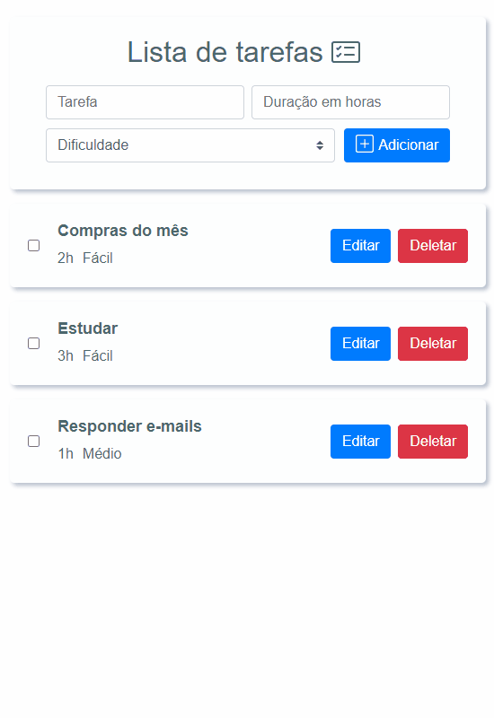

# todo-list

## ToDo list feito em VueJS.


### Após clonar o repositório, rodar o comando:
```
npm install
```

### Após a instalação das dependências, rodar:
```
npm run serve
```
No próprio terminal, será indicado o endereço para acessar o localhost e testar a aplicação.
